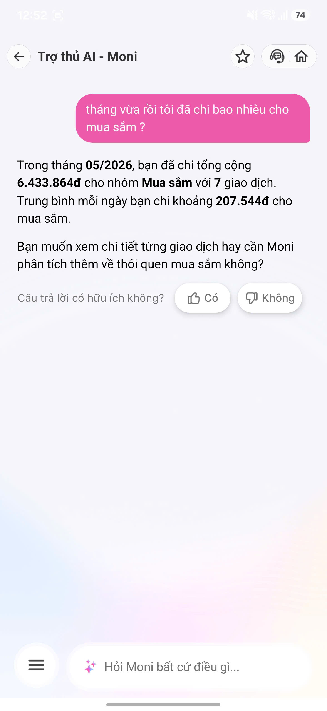
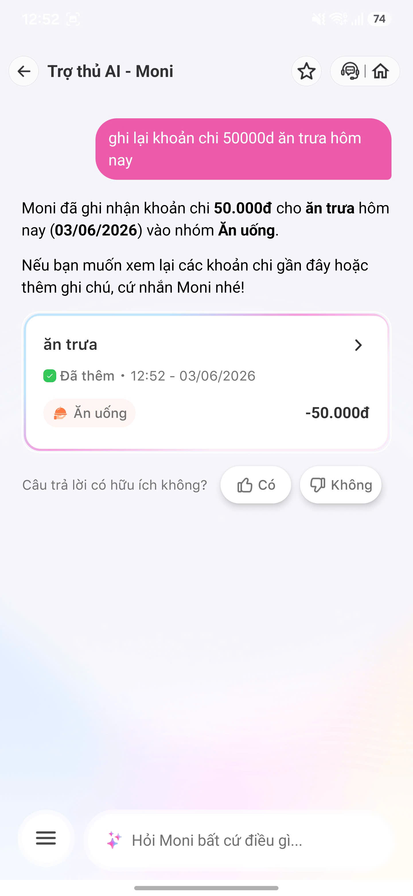
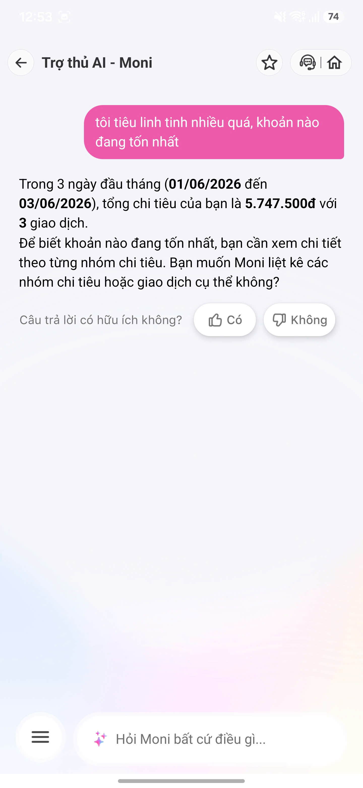
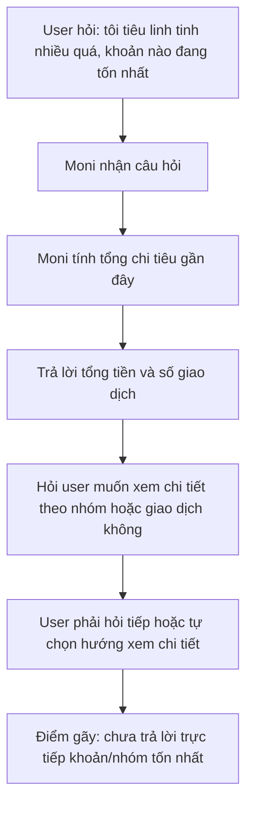
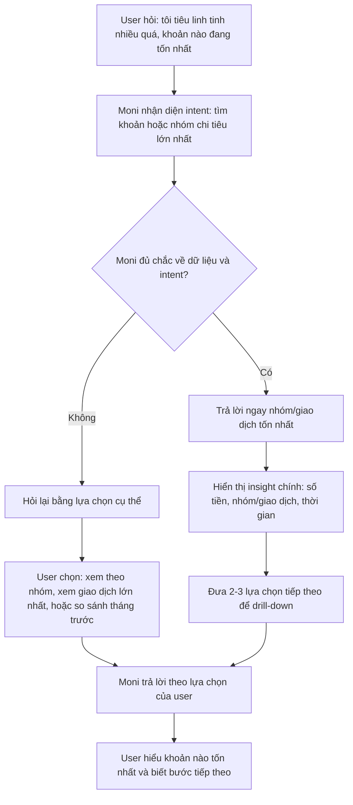

# App Teardown: MoMo Moni

## 0. Thông tin chung

- **Tên sản phẩm/app:** MoMo
- **AI feature được phân tích:** Moni - trợ thủ AI hỗ trợ quản lý chi tiêu cá nhân
- **Nền tảng truy cập:** Ứng dụng MoMo
- **Ngày dùng thử:** 03/06/2026
- **Bối cảnh dùng thử:** Người dùng muốn hỏi nhanh về chi tiêu, ghi nhận khoản chi và biết nhóm chi tiêu nào đang tốn nhiều tiền.

## 1. Promise vs Reality

### Product hứa gì?

MoMo định vị Moni như một trợ thủ tài chính dùng AI, giúp người dùng quản lý chi tiêu dễ hơn bằng cách hỏi đáp qua chat, ghi nhận khoản chi, phân loại giao dịch và phân tích thói quen chi tiêu.

### User nào được hứa sẽ được giúp?

Người dùng MoMo có nhiều giao dịch hằng ngày như mua sắm, ăn uống, chuyển tiền, thanh toán hóa đơn và muốn hiểu tiền của mình đang đi đâu.

### Kỳ vọng ban đầu

Tôi kỳ vọng Moni có thể hiểu câu hỏi tự nhiên, trả lời bằng số liệu chi tiêu cụ thể, ghi nhận khoản chi đúng danh mục và hỏi lại khi câu hỏi chưa đủ rõ.

### Reality quan sát được

Moni xử lý tốt các câu hỏi rõ ràng như hỏi tổng chi tiêu theo nhóm hoặc ghi lại khoản chi cụ thể. Tuy nhiên, với câu hỏi mơ hồ như "tôi tiêu linh tinh nhiều quá, khoản nào đang tốn nhất", Moni chưa trả lời thẳng nhóm tốn nhất mà yêu cầu user tiếp tục chọn xem chi tiết theo nhóm hoặc giao dịch.

## 2. Evidence

### Prompt 1

```text
tháng vừa rồi tôi đã chi bao nhiêu cho mua sắm?
```



**Observation:** Moni trả lời trong tháng 05/2026 user đã chi tổng cộng **6.433.864đ** cho nhóm **Mua sắm** với **7 giao dịch**, trung bình mỗi ngày khoảng **207.544đ**. Đây là happy path vì câu hỏi rõ danh mục và thời gian.

### Prompt 2

```text
ghi lại khoản chi 50000đ ăn trưa hôm nay
```



**Observation:** Moni ghi nhận khoản chi **50.000đ** cho **ăn trưa hôm nay (03/06/2026)** vào nhóm **Ăn uống** và tạo thẻ giao dịch. Đây là happy path cho tác vụ ghi nhận chi tiêu.

### Prompt 3

```text
tôi tiêu linh tinh nhiều quá, khoản nào đang tốn nhất
```



**Observation:** Moni trả lời tổng chi tiêu trong 3 ngày đầu tháng là **5.747.500đ** với **3 giao dịch**, nhưng chưa chỉ ra ngay khoản/nhóm nào đang tốn nhất. Moni yêu cầu user xem chi tiết theo nhóm chi tiêu hoặc giao dịch cụ thể. Đây là low-confidence path khá ổn vì Moni không tự đoán "linh tinh" là danh mục nào, nhưng câu trả lời vẫn còn thiếu lựa chọn thao tác nhanh.

## 3. Phân tích 4 Paths

### Happy Path

Khi user hỏi rõ danh mục và thời gian, ví dụ "tháng vừa rồi tôi đã chi bao nhiêu cho mua sắm?", Moni trả lời được tổng tiền, số giao dịch và mức chi trung bình/ngày. Khi user ghi khoản chi rõ ràng, Moni cũng lưu đúng số tiền, ngày và danh mục.

### Low-confidence Path

Khi user dùng câu mơ hồ như "tiêu linh tinh", Moni không tự gán bừa vào một danh mục. Tuy nhiên, Moni chỉ hỏi user muốn xem chi tiết theo nhóm hay giao dịch, chưa đưa nút chọn nhanh hoặc danh sách nhóm chi tiêu ngay trong câu trả lời.

### Failure Path

Failure có thể xảy ra nếu Moni hiểu sai ý định "khoản nào đang tốn nhất" và chỉ trả lời tổng chi tiêu thay vì chỉ ra nhóm/giao dịch lớn nhất. User vẫn phải hỏi tiếp nên workflow chưa hoàn thành ngay.

### Correction Path

Trong các ảnh hiện có, chưa thấy rõ cơ chế sửa hoặc lưu correction nếu Moni phân loại sai. Với sản phẩm quản lý chi tiêu, đây là phần cần có để user sửa danh mục và giúp hệ thống phân loại tốt hơn lần sau.

## 4. Finding chính

```text
Khi user hỏi một câu phân tích chi tiêu có ý định hơi mơ hồ như "tôi tiêu linh tinh nhiều quá, khoản nào đang tốn nhất",
AI/product trả lời được tổng chi tiêu nhưng chưa chỉ ra ngay nhóm hoặc giao dịch tốn nhất,
hậu quả là user phải hỏi tiếp hoặc tự đi xem chi tiết, khiến workflow phân tích chi tiêu chưa hoàn thành trong một lượt.
Lỗi thuộc layer Intent + UX Recovery.
Nên sửa bằng low-confidence path tốt hơn: đưa ngay 2-3 lựa chọn như "Xem theo nhóm chi tiêu", "Xem giao dịch lớn nhất", "So sánh với tháng trước" để user tiếp tục nhanh.
```

## 5. Sketch As-is / To-be

### As-is

```text
User hỏi: "tôi tiêu linh tinh nhiều quá, khoản nào đang tốn nhất"
  ↓
Moni tính tổng chi tiêu trong khoảng thời gian gần đây
  ↓
Moni trả lời tổng tiền và số giao dịch
  ↓
Moni hỏi user có muốn xem chi tiết theo nhóm/giao dịch không
  ↓
Điểm gãy: user chưa nhận được ngay câu trả lời "khoản nào tốn nhất"
```



### To-be

```text
User hỏi: "tôi tiêu linh tinh nhiều quá, khoản nào đang tốn nhất"
  ↓
Moni nhận diện intent: tìm khoản/nhóm chi tiêu lớn nhất
  ↓
Moni trả lời ngay nhóm hoặc giao dịch tốn nhất
  ↓
Moni hiển thị 2-3 lựa chọn tiếp theo:
- Xem chi tiết theo nhóm
- Xem giao dịch lớn nhất
- Gợi ý cách giảm chi
  ↓
User chọn một hướng và tiếp tục phân tích
```



## 6. SPEC Change

```text
SPEC cần bổ sung behavior cho câu hỏi phân tích chi tiêu mơ hồ: khi user hỏi "khoản nào đang tốn nhất" hoặc dùng từ không rõ như "linh tinh", Moni phải trả lời bằng insight chính trước, sau đó đưa 2-3 lựa chọn tiếp theo để user drill-down.
```

## 7. Checklist

- [x] Có screenshot hoặc observation cụ thể.
- [x] Có prompt/input đã thử.
- [x] Có đủ 4 paths hoặc ghi rõ path nào chưa thấy trong product.
- [x] Finding được viết thành product decision.
- [x] Có sketch as-is và to-be.
- [x] Có câu SPEC change.
